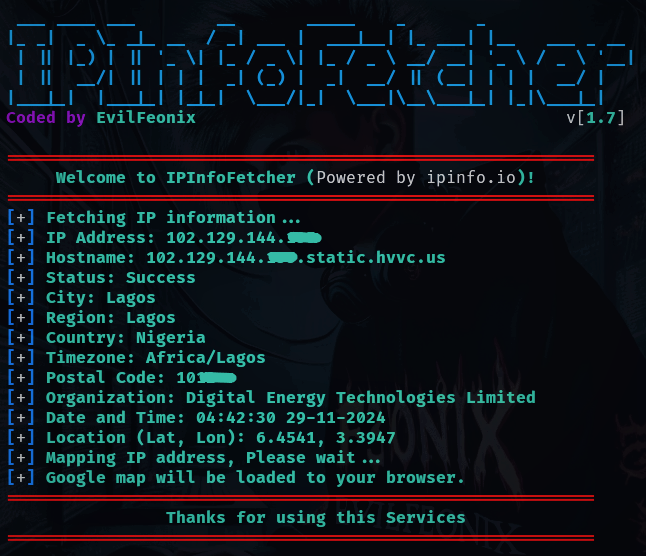

 

# **IP address Information Fetcher v[1.7]**

<!-- [IPInfoFetcher v2.7](https://github.com/evilfeonix/IPInfoFetcher/blob/main/fetcher.png) -->


# **IPInfoFetcher**

**IPInfoFetcher** (_IP Information Fetcher_) Powered by **ipinfo.io**, This is an IP lookup tool that enables users to trace but IPv4 and IPv6 (_including their public IP address_), which can then reveal their[victims] device's IP address, location, internet service provider (ISP), approximate location (city or country) and other details. However, this wouldn't typically reveal their device model or network carrier.

## **What's an IP address**

An IP (**Internet Protocol**) address is a unique numerical label or identifier assigned to each device on a network, allowing devices to communicate with each other and access online services. IP address is what identifies devices on a network. Now let get back to **IPInfoFetcher** (IP address Information Fetcher), a python script design to Fetch some of the usefull IP informations that include **ISP** (Internet Service Provider), hostname, city, country, zip code, organizations, location (latitude, longitude) and also has the ability to mapped the approximate location of the targetted IP address.

## **IPInfoFetcher (Important Note)**

**IPInfoFetcher** allows mapping the approximate location of an IP address all around the word, but not to map the exact locations. Here's why:

1. **IP geolocation databases**: These databases map IP addresses to geographic locations, but they are not always accurate or up-to-date. They may point to a nearby city or region, but not the exact location.
2. **IP address allocation**: IP addresses are allocated to Internet Service Providers (ISPs) and organizations in blocks, so the IP geolocation database may only know the location of the ISP or organization, not the individual user.
3. **User mobility**: Users can connect to the internet from different locations, making IP geolocation less accurate.
4. **VPN and proxy servers**: Users may use VPNs or proxy servers, which can mask their actual IP address and location.

Even if the user is not connected to the internet, their IP address can still be traced to a general location if:

- _Their device is connected to a cellular network_: Cell towers can provide approximate location data.
- _Their device has GPS capabilities_: GPS data can be used to determine the device's location, even if it's not connected to the internet.

## **IPInfoFetcher Installation**
```bash
apt update && apt upgrade
```
```bash
apt install git
```
```bash
apt install python3
```
```bash
git clone https://github.com/evilfeonix/IPInfoFetcher.git
```


## **Run IPInfoFetcher**

After installing all the necessary dependencies, run the tool:  by passing in the target IP address:
```bash
cd IPInfoFetcher
```
```bash
python3 fetcher.py -i 102.129.144.135 -m
```

## **IPInfoFetcher Usage**

```py
"""
Usage: python3 fetcher.py [OPTION... [-i], [-p], [-m], [-a], [-u]]
-------
OPTION:
    -i  Specify the target IP address
    -p  This option will fetch your public IP address
    -m  Map the target IP address after fetching it information
    -a  About Tool and Author's Contact Information
    -u  Update IPInfoFetcher Script for Better performance
EXAMPLES:
    python3 fetcher.py -a
    python3 fetcher.py -u
    python3 fetcher.py -p
    python3 fetcher.py -p -m
    python3 fetcher.py -i 192.168.15.25
    python3 fetcher.py -i 192.168.15.25 -m
"""
```


### **Important Note:**

>**Location accuracy**: _IP geolocation and cellular network-based location data may not be as accurate as GPS data._

>**Privacy concerns**: _Tracking a user's location without their consent raises significant privacy concerns._

### **Support Us**

_Support us by liking, forking, and sharing our repo and also follow us on [github.com](https://github.com/evilfeonix), [instagram.com](https://instagram.com/evilfeonix), and [youtub.com](https://youtub.com/@3V1LF30N1X) for latest hacking tips and tricks._

>

### **License**

[_This project is licensed under the GPL License_](https://github.com/evilfeonix/IPInfoFetcher/blob/main/LICENSE) 